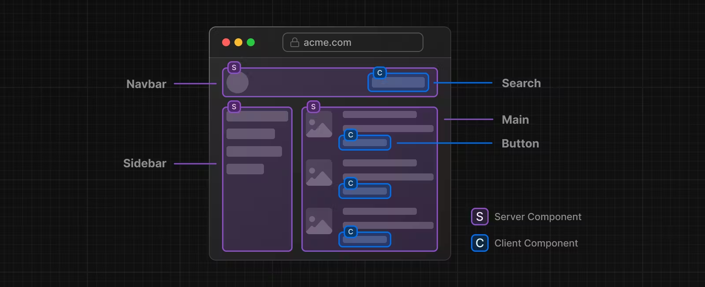
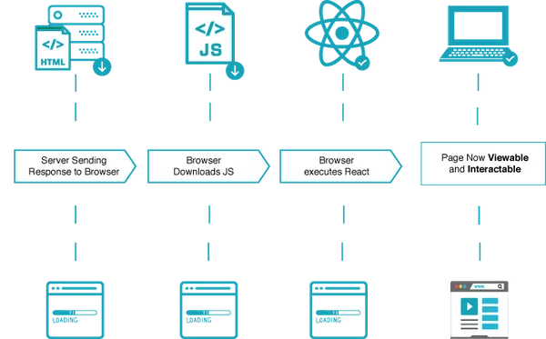
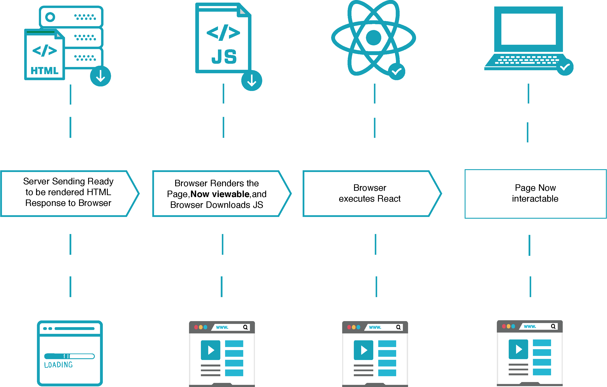
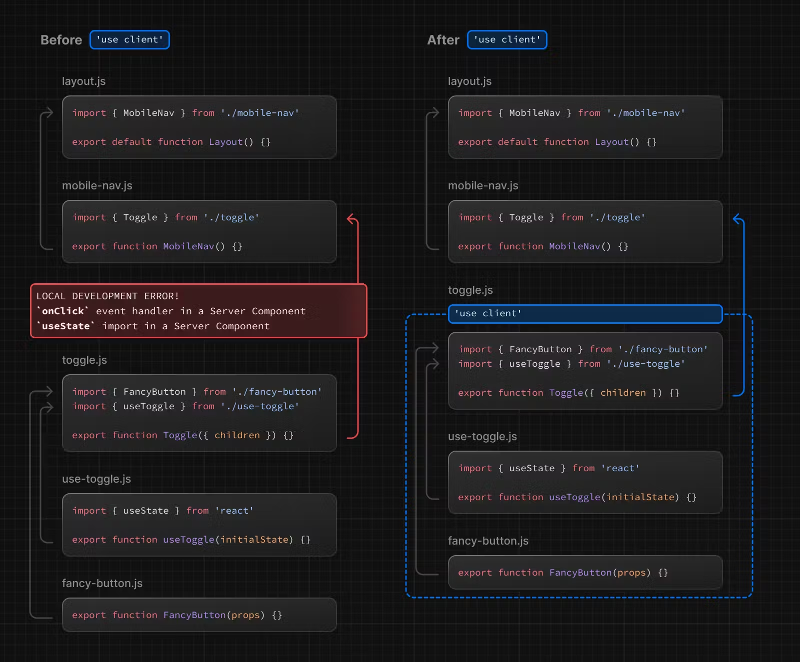

# React Essentials

## 1. 서버 컴포넌트

클라이언트 컴포넌트(csr) + 서버 컴포넌트(ssr) => 하이브리드

### 서버 컴포넌트 생각해보기



- 페이지를 컴포넌트 단위로 쪼개다보면 대부분의 컴포넌트는 인터렉션이 없어 서버에서 렌더링이 가능
- 인터렉티브 UI의 경우를 제한적으로 클라이언트 컴포넌트로 사용

### 왜 서버 컴포넌트인가?

#### CSR의 경우



- 느린 초기로딩
- 이후 빠른 반응성
- 인터렉션 연산을 클라이언트측에 위임

#### SSR의 경우



- 빠른 초기 로딩
- 라우터 전환시마다 페이지 로딩이 필요

#### 서버 컴포넌트를 사용하면

- 데이터베이스에 더 가까운 서버로 데이터 로드,
- 큰 자바스크립트 번들구성을 서버에 유지하여 성능 향상
- 서버 컴포넌트를 사용하면 React의 성능과 유연성, UI 템플릿을 위한 컴포넌트 모델을 사용 가능
- 클라이언트 컴포넌트와 서버컴포넌트는 점진적으로 클라이언트에게 인계되며
- 상호작용을 추가할 수 있도록 서버와 클라이언트 측 런타임을 비동기적으로 로드
- 서버컴포넌트는 앱라우터를 포함하여, [스페셜 파일](https://nextjs.org/docs/app/building-your-application/routing#file-conventions), [코로케이션 컴포넌트](https://nextjs.org/docs/app/building-your-application/routing#colocation)를 지칭

## 2. 클라이언트 컴포넌트

- 주로 애플리케이션에 클라이언트 측 인터랙션을 담당
- 클라이언트 컴포넌트는 넥스트에서 미리 렌더링되어짐.
  - HTML뼈대 생성
  - 리액트 자바스크립트 채워주기(하이드레이트)
- 페이지 라우터가 항상 작동하는 방식

### "use client" 디렉티브

"use client" 지시어를 통해 클라이언트 컴포넌트로 동작

```tsx filename="app/counter.tsx" highlight={1} switcher
'use client'

import { useState } from 'react'

export default function Counter() {
	const [count, setCount] = useState(0)

	return (
		<div>
			<p>You clicked {count} times</p>
			<button onClick={() => setCount(count + 1)}>Click me</button>
		</div>
	)
}
```

> **알아두면 좋은 정보**:
>
> - `"use client"`
> - 임포트 문 **위에** 위치
> - !! **해당 파일에서 임포트한 하위 모듈은 클라이언트 번들로 간주**
>   - 이 규칙 때문에 본문에서는 경계라고 표현
>   - 클라이언트 컴포넌트의 최상위 컴포넌트만 디렉티브를 사용하면 댐
> - 해당 디렉티브가 없는 모든 컴포넌트는 서버 컴포넌트 -> 서버에서만 렌더링
> - (next의 경우) 클라이언트 컴포넌트는 서버에서 미리 렌더링한 후 클라이언트에 하이드레이션
>
> **참고**
>
> - 모듈그래프라는 포현은 넥스트js의 모듈 표현법으로 의존관계에 있는 모듈들이 그래프구조로 연결되기 때문에 모듈그래프라 지칭
> - 해당 본문에는 모듈그래프라는 표현을 제거해도 이해에 문제가 없을것으로 판단하여 해당표현을 삭제함



## 3. 서버 컴포넌트와 클라이언트 컴포넌트는 언제 사용해야 하나요?

- 기본 : 서버컴포넌트

|                                                                                 | 서버 컴포넌트 | 클라이언트 컴포넌트 |
| ------------------------------------------------------------------------------- | :-----------: | :-----------------: |
| 서버에 민감한 정보(액세스 토큰, API 키 등) 보관                                 |       x       |          x          |
| 데이터를 가져옵니다.                                                            |       o       |          x          |
| 백엔드 리소스에 직접 액세스 (직접)                                              |       o       |          x          |
| 서버에 대한 대규모 종속성 유지/클라이언트 측 자바스크립트 감소                  |       o       |          x          |
| **상호작용 및 이벤트 리스너 추가(`onClick()`, `onChange()` 등)**                |       x       |          o          |
| **상태 및 수명 주기 효과 사용(`useState()`, `useReducer()`, `useEffect()` 등)** |       x       |          o          |
| **브라우저 전용 API 사용**                                                      |       x       |          o          |
| **상태, 효과 또는 브라우저 전용 API에 종속되는 훅 사용**                        |       x       |          o          |
| **React 클래스 컴포넌트 사용**                                                  |       x       |          o          |

## 4. 패턴

### 클라이언트 컴포넌트를 상단에 배치

- 클라이언트 컴포넌트는 가능한 컴포넌트 트리의 왼쪽(앞쪽)에 위치

```tsx filename="app/layout.tsx" switcher
// SearchBar는 클라이언트 컴포넌트
import SearchBar from './searchbar'
// 로고는 서버 컴포넌트
import Logo from './logo'

// 레이아웃은 기본적으로 서버 컴포넌트
export default function Layout({ children }: { children: React.ReactNode }) {
	return (
		<>
			<nav>
				<Logo />
				<SearchBar />
			</nav>
			<main>{children}</main>
		</>
	)
}
```

### 컴포넌트의 랜더링

1. 서버 : **모든** 서버 컴포넌트 렌더링(클라이언트 컴포넌트 스킵)
2. 클라이언트 : 클라이언트 컴포넌트 렌더링 + 서버가 렌더링해준 서버컴포넌트 결과값을 *슬롯*에 삽입하여 병합
3. (참고)넥스트js : 초기 페이지 진입 시 모든 컴포넌트(클라이언트 컴포넌트 포함)가 서버에서 미리 렌더링

### 클라이언트 컴포넌트 > 서버 컴포넌트 중첩

#### 잘못된 예 : import {ServerComponent}

```tsx filename="app/example-client-component.tsx" switcher highlight={5,18}
'use client'

// 서버 컴포넌트를 클라이언트 컴포넌트에 임포트하면
// 이 컴포넌트는 클라이언트 컴포넌트 트리에 종속되어 클라이언트컴포넌트로 작동
import ExampleServerComponent from './example-server-component'

export default function ExampleClientComponent() {
	return (
		<>
			<ExampleServerComponent />
		</>
	)
}
```

#### 잘된 예: {children} 서버 컴포넌트 프롭 전달

```tsx filename="app/page.tsx"  highlight={11} switcher
// "use client" 디렉티브가 없는 서버컴포넌트(기본값)
import ExampleClientComponent from './example-client-component'
import ExampleServerComponent from './example-server-component'

export default function Page() {
	return (
		<ExampleClientComponent>
			{' '}
			{/*<- 클라이언트 컴포넌트*/}
			<ExampleServerComponent /> {/*<- 서버 컴포넌트 프롭전달*/}
		</ExampleClientComponent>
	)
}
```

```tsx filename="app/example-client-component.tsx" switcher highlight={6,16}
'use client'

import { useState } from 'react'

export default function ExampleClientComponent({
	children, // <- 여기로 서버컴포넌트 전달
}: {
	children: React.ReactNode
}) {
	return (
		<>
			...
			{children} {/*<-슬롯으로 병합*/}
		</>
	)
}
```

> **참고**
>
> - 컴포지션 전략 : 이 패턴은 레이아웃과 페이지에 `children` 프로퍼티로 **이미 적용**되어 사용
> - 컨텐츠 리프팅 전략 : 자식컴포넌트의 상태가 변경되었을때 자식컴포넌트를 리랜더링 하지 않고 부모컴포넌트에서 자식 컴포넌트 상태를 가져와서 리랜더링. 이 패턴에서도 사용됌
> - `children` 프롭 외에 어떤 프롭을 사용해도 JSX를 전달할 수 있습니다

### 서버에서 클라이언트 컴포넌트로 프롭 전달하기(직렬화)

서버에서 클라이언트 컴포넌트로 전달되는 프로퍼티는 [직렬화 가능](https://developer.mozilla.org/en-US/docs/Glossary/Serialization)이어야 합니다. 즉, 함수, 날짜 등과 같은 값은 클라이언트 컴포넌트에 직접 전달할 수 없습니다.

> \*\*네트워크 경계는 어디인가요?
>
> 앱 라우터에서 네트워크 경계는 서버 컴포넌트와 클라이언트 컴포넌트 사이입니다. 이는 `getStaticProps`/`getServerSideProps`와 페이지 컴포넌트 사이에 경계가 있는 페이지와는 다릅니다. 서버 컴포넌트 내부에서 가져온 데이터는 클라이언트 컴포넌트로 전달되지 않는 한 네트워크 경계를 넘지 않으므로 직렬화할 필요가 없습니다. 서버 컴포넌트를 사용한 [데이터 불러오기](/docs/app/building-your-application/data-fetching#fetching-data-on-the-server)에 대해 자세히 알아보세요.

- 여기 좀 자세히 설명해주실분 계실까용

### 서버 전용 코드를 클라이언트 컴포넌트에서 제외하기(포이즌)

```ts filename="lib/data.ts" switcher
export async function getData() {
	const res = await fetch('https://external-service.com/data', {
		headers: {
			authorization: process.env.API_KEY, // <-- 서버전용코드
			// 넥스트에서 클라이언트에서 공개 환경변수는
			// NEXT_PUBLIC 키워드를 지시해줘야함
		},
	})

	return res.json()
}
```

- process.env 는 기본적으로 비공개
- Next.js는 보안 정보 유출을 방지하기 위해 **클라이언트 코드에서 비공개 환경 변수를 빈 문자열로 대체**
- 즉 클라이언트측에서 제대로 동작하지 않음

### "server-only" 패키지

- 서버 모듈을 클라이언트 컴포넌트로 임포트하는 경우 빌드 타임 오류를 발생

```bash filename="Terminal"
npm install server-only
```

```js filename="lib/data.js"
import 'server-only'

export async function getData() {
	const res = await fetch('https://external-service.com/data', {
		headers: {
			authorization: process.env.API_KEY,
		},
	})

	return res.json()
}
```

- 해당 패키지 `client-only`를 사용하여 클라이언트 전용 코드(예: `window` 객체에 액세스하는 코드)가 포함된 모듈을 표시 가능

### 데이터 페칭

- 일반적으로 서버 컴포넌트에서 데이터를 가져오는 것이 성능과 사용자 경험면에서 좋습니다.

### 서드파티 패키지에서의 "use client"

- 클라이언트 단에서 사용되는 서드파티 패키지의 대부분은 "use client" 지시어를 사용하지 않았습니다.
- 서드파티 패키지를 클라이언트 전용으로 만들어진 경우 문제가 없지만
- 서버 컴포넌트에서 임포트하면 다음과 같은 문제가 발생합니다.

```tsx filename="app/page.tsx" switcher
import { Carousel } from 'acme-carousel'

export default function Page() {
	return (
		<div>
			<p>View pictures</p>

			{/* Error: `useState` can not be used within Server Components */}
			<Carousel />
		</div>
	)
}
```

- 이 문제는 아래와 같이 래핑해서 해결합니다.

```tsx filename="app/carousel.tsx" switcher
'use client'

import { Carousel } from 'acme-carousel'

export default Carousel
```

이제 서버 컴포넌트 내에서 바로 `<Carousel />`을 사용할 수 있습니다:

```tsx filename="app/page.tsx" switcher
import Carousel from './carousel'

export default function Page() {
	return (
		<div>
			<p>View pictures</p>

			{/*  Works, since Carousel is a Client Component */}
			<Carousel />
		</div>
	)
}
```

- 대부분의 서드파티 패키지는 클라이언트에서 사용하지만
- 공급자 컴포넌트의 경우 React 상태와 컨텍스트에 의존하고 일반적으로 애플리케이션의 루트에 필요합니다.
- [서드파티 컨텍스트 프로바이더](https://nextjs.org/docs/getting-started/react-essentials#rendering-third-party-context-providers-in-server-components)에 대해 알아보세요

#### 라이브러리 작성자

- 클라이언트 사이드에서 구동시킬 모듈의 경우 "use client" 지시어를 사용하면 사용자가 래핑 할 필요가 없습니다.
- 트리에서 더 깊숙이 "use client"를 사용하여 가져온 모듈이 서버 컴포넌트 모듈 그래프의 일부가 되도록 함으로써 패키지를 최적화할 수 있습니다.
- 일부 번들러는 번들링과 동시에 `"use client"` 지시문을 제거할 수 있다는 점에 유의할 필요가 있습니다.
- `"use client"` 지시어를 포함하도록 esbuild를 구성하는 예제는 [React Wrap Balancer](https://github.com/shuding/react-wrap-balancer/blob/main/tsup.config.ts#L10-L13) 및 [Vercel Analytics](https://github.com/vercel/analytics/blob/main/packages/web/tsup.config.js#L26-L30) 리포지토리에서 찾을 수 있습니다.

## 5. 컨텍스트

대부분의 React 애플리케이션은 컴포넌트 간에 데이터를 공유하기 위해 [`createContext`](https://react.dev/reference/react/useContext)를 통해 직접 또는 서드파티 라이브러리에서 가져온 공급자 컴포넌트를 통해 간접적으로 [context](https://react.dev/reference/react/useContext)에 의존합니다.

- 컨텍스트는 클라이언트 컴포넌트에서 완벽지원
- 서버컴포넌트에서 컨텍스트는 오류발생 -> 클라이언트 컴포넌트로 래핑해서 사용

### 클라이언트 컴포넌트에서 컨텍스트 사용하기

```tsx filename="app/sidebar.tsx" switcher
'use client'

import { createContext, useContext, useState } from 'react'

const SidebarContext = createContext()

export function Sidebar() {
	const [isOpen, setIsOpen] = useState()

	return (
		<SidebarContext.Provider value={{ isOpen }}>
			<SidebarNav />
		</SidebarContext.Provider>
	)
}

function SidebarNav() {
	let { isOpen } = useContext(SidebarContext)

	return (
		<div>
			<p>Home</p>

			{isOpen && <Subnav />}
		</div>
	)
}
```

- 그러나 컨텍스트 공급자는 일반적으로 현재 테마와 같은 글로벌 관심사를 공유하기 위해 애플리케이션의 루트 근처에 렌더링됩니다.
- 컨텍스트는 서버 컴포넌트에서 지원되지 않으므로 애플리케이션의 루트에서 컨텍스트를 만들려고 하면 오류가 발생합니다:

```tsx filename="app/layout.tsx" switcher
import { createContext } from 'react'

//  createContext is not supported in Server Components
export const ThemeContext = createContext({})

export default function RootLayout({ children }) {
	return (
		<html>
			<body>
				<ThemeContext.Provider value="dark">{children}</ThemeContext.Provider>
			</body>
		</html>
	)
}
```

- 이 문제를 해결하려면 컨텍스트를 생성하고 클라이언트 컴포넌트 내에서 해당 프로바이더를 렌더링하세요:

```tsx filename="app/theme-provider.tsx" switcher
'use client'

import { createContext } from 'react'

export const ThemeContext = createContext({})

export default function ThemeProvider({ children }) {
	return <ThemeContext.Provider value="dark">{children}</ThemeContext.Provider>
}
```

- 이제 서버 컴포넌트가 클라이언트 컴포넌트로 표시되었으므로 공급자를 직접 렌더링할 수 있습니다:

```jsx filename="app/layout.js" switcher
import ThemeProvider from './theme-provider'

export default function RootLayout({ children }) {
	return (
		<html>
			<body>
				<ThemeProvider>{children}</ThemeProvider>
			</body>
		</html>
	)
}
```

### 서버 컴포넌트에서 서드파티 컨텍스트 제공자 렌더링하기

- 서드파티 패키지는 "use client" 디렉티브가 없을 경우가 많고
- 서버컴포넌트에서 이런 패키지를 사용하려면 다음과 같은 오류가 발생할 수 있습니다

```jsx filename="app/layout.js" switcher
import { ThemeProvider } from 'acme-theme'

export default function RootLayout({ children }) {
	return (
		<html>
			<body>
				{/*  Error: `createContext` can't be used in Server Components */}
				<ThemeProvider>{children}</ThemeProvider>
			</body>
		</html>
	)
}
```

- 클라이언트 컴포넌트로 래핑하면 해결됩니다

```jsx filename="app/providers.js"
'use client'

import { ThemeProvider } from 'acme-theme'
import { AuthProvider } from 'acme-auth'

export function Providers({ children }) {
	return (
		<ThemeProvider>
			<AuthProvider>{children}</AuthProvider>
		</ThemeProvider>
	)
}
```
```jsx filename="app/layout.js"
import { Providers } from './providers'

export default function RootLayout({ children }) {
	return (
		<html>
			<body>
				<Providers>{children}</Providers>
			</body>
		</html>
	)
}
```


### 서버 컴포넌트 간 데이터 공유

- 서버 컴포넌트는 인터랙티브하지 않고 React 상태값이나 컨텍스트를 사용하지 않습니다.
- 대신 여러 서버 컴포넌트가 액세스해야 하는 공통 데이터에 네이티브 자바스크립트 패턴을 사용할 수 있습니다.
- 예를 들어 모듈을 사용해 여러 컴포넌트에서 데이터베이스 연결을 공유할 수 있습니다:

```js filename="utils/database.js" switcher
// 글로벌 싱글톤 공유
export const db = new DatabaseConnection()
```

```jsx filename="app/users/layout.js" switcher
import { db } from '@utils/database'

export async function UsersLayout() {
	let users = await db.query()
	// ...
}
```

```jsx filename="app/users/[id]/page.js" switcher
import { db } from '@utils/database'

export async function DashboardPage() {
	let user = await db.query()
	// ...
}
```

### 서버 컴포넌트 간 `fetch` 요청 값 공유

- 여러 컴포넌트에서 하나의 페치데이터 결과를 공유하고 싶을 때, 프롭스로 전달 가능하지만
- 넥스트에서는 데이터 `fetch`의 중복요청이 있을 때, 에서 자동적으로 캐싱이 이루어지며, 같은 `fetch` 의 결과물을 공유 받을 수 있습니다.
