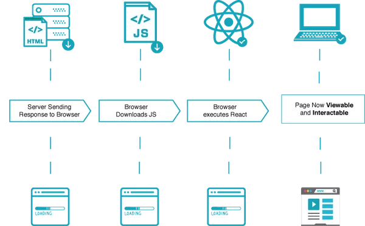

# React Essentials

## 1. 서버 컴포넌트

클라이언트 컴포넌트(csr) + 서버 컴포넌트(ssr) => 하이브리드

### 서버 컴포넌트 생각해보기


- 페이지를 컴포넌트 단위로 쪼개다보면 대부분의 컴포넌트는 인터렉션이 없어 서버에서 렌더링이 가능
- 인터렉티브 UI의 경우를 제한적으로 클라이언트 컴포넌트로 사용

### 왜 서버 컴포넌트인가?

#### CSR의 경우



- 느린 초기로딩
- 이후 빠른 반응성
- 인터렉션 연산을 클라이언트측에 위임

#### SSR의 경우


- 빠른 초기 로딩
- 라우터 전환시마다 페이지 로딩이 필요

#### 서버 컴포넌트를 사용하면

- 데이터베이스에 더 가까운 서버로 데이터 로드,
- 큰 자바스크립트 번들구성을 서버에 유지하여 성능 향상
- 서버 컴포넌트를 사용하면 React의 성능과 유연성, UI 템플릿을 위한 컴포넌트 모델을 사용 가능
- 클라이언트 컴포넌트와 서버컴포넌트는 점진적으로 클라이언트에게 인계되며
- 상호작용을 추가할 수 있도록 서버와 클라이언트 측 런타임을 비동기적으로 로드
- 서버컴포넌트는 앱라우터를 포함하여, [스페셜 파일](https://nextjs.org/docs/app/building-your-application/routing#file-conventions), [코로케이션 컴포넌트](https://nextjs.org/docs/app/building-your-application/routing#colocation)를 지칭

## 2. 클라이언트 컴포넌트

- 주로 애플리케이션에 클라이언트 측 인터랙션을 담당
- 클라이언트 컴포넌트는 넥스트에서 미리 랜더링되어짐.
  - HTML뼈대 생성
  - 리액트 자바스크립트 채워주기(하이드레이트)
- 페이지 라우터가 항상 작동하는 방식

### "use client" 디렉티브

"use client" 디렉티브를 통해 클라이언트 컴포넌트로 동작

```tsx filename="app/counter.tsx" highlight={1} switcher
'use client'

import { useState } from 'react'

export default function Counter() {
	const [count, setCount] = useState(0)

	return (
		<div>
			<p>You clicked {count} times</p>
			<button onClick={() => setCount(count + 1)}>Click me</button>
		</div>
	)
}
```

```jsx filename="app/counter.js" highlight={1} switcher
'use client'

import { useState } from 'react'

export default function Counter() {
	const [count, setCount] = useState(0)

	return (
		<div>
			<p>You clicked {count} times</p>
			<button onClick={() => setCount(count + 1)}>Click me</button>
		</div>
	)
}
```

> **알아두면 좋은 정보**:
>
> - `"use client"`
> - 임포트 문 **위에** 위치
> - !! **해당 파일에서 임포트한 하위 모듈은 클라이언트 번들로 간주**
>   - 이 규칙 때문에 본문에서는 경계라고 표현
>   - 클라이언트 컴포넌트의 최상위 컴포넌트만 디렉티브를 사용하면 됌
> - 해당 디렉티브가 없는 모든 컴포넌트는 서버 컴포넌트 -> 서버에서만 렌더링
> - (next의 경우) 클라이언트 컴포넌트는 서버에서 미리 렌더링한 후 클라이언트에 하이드레이션
>
> **참고**
>
> - 모듈그래프라는 포현은 넥스트js의 모듈 표현법으로 의존관계에 있는 모듈들이 그래프구조로 연결되기 때문에 모듈그래프라 지칭
> - 해당 본문에는 모듈그래프라는 표현을 제거해도 이해에 문제가 없을것으로 판단하여 해당표현을 삭제함


## 3. 서버 컴포넌트와 클라이언트 컴포넌트는 언제 사용해야 하나요?

- 기본 : 서버컴포넌트

|                                                                                 | 서버 컴포넌트 | 클라이언트 컴포넌트 |
| ------------------------------------------------------------------------------- | :-----------: | :-----------------: |
| 서버에 민감한 정보(액세스 토큰, API 키 등) 보관                                 |       x       |          x          |
| 데이터를 가져옵니다.                                                            |       o       |          x          |
| 백엔드 리소스에 직접 액세스 (직접)                                              |       o       |          x          |
| 서버에 대한 대규모 종속성 유지/클라이언트 측 자바스크립트 감소                  |       o       |          x          |
| **상호작용 및 이벤트 리스너 추가(`onClick()`, `onChange()` 등)**                |       x       |          o          |
| **상태 및 수명 주기 효과 사용(`useState()`, `useReducer()`, `useEffect()` 등)** |       x       |          o          |
| **브라우저 전용 API 사용**                                                      |       x       |          o          |
| **상태, 효과 또는 브라우저 전용 API에 종속되는 훅 사용**                        |       x       |          o          |
| **React 클래스 컴포넌트 사용**                                                  |       x       |          o          |

## 4. 패턴

### 클라이언트 컴포넌트를 상단에 배치

- 클라이언트 컴포넌트는 가능한 컴포넌트 트리의 왼쪽(앞쪽)에 위치

```tsx filename="app/layout.tsx" switcher
// SearchBar는 클라이언트 컴포넌트
import SearchBar from './searchbar'
// 로고는 서버 컴포넌트
import Logo from './logo'

// 레이아웃은 기본적으로 서버 컴포넌트
export default function Layout({ children }: { children: React.ReactNode }) {
	return (
		<>
			<nav>
				<Logo />
				<SearchBar />
			</nav>
			<main>{children}</main>
		</>
	)
}
```

### 클라이언트 및 서버 컴포넌트 구성하기

서버 컴포넌트와 클라이언트 컴포넌트는 같은 컴포넌트 트리에서 결합할 수 있습니다.

백그라운드에서 React는 다음과 같이 렌더링을 처리합니다:

- 서버에서 React는 결과를 클라이언트로 보내기 전에 **모든** 서버 컴포넌트를 렌더링합니다.
  - 여기에는 클라이언트 컴포넌트 안에 중첩된 서버 컴포넌트가 포함됩니다.
  - 이 단계에서 발생하는 클라이언트 컴포넌트는 건너뜁니다.
- 클라이언트에서 React는 클라이언트 컴포넌트를 렌더링하고 서버 컴포넌트의 렌더링 결과를 _슬롯에_ 삽입하여 서버와 클라이언트에서 수행한 작업을 병합합니다.
  - 서버 컴포넌트가 클라이언트 컴포넌트 안에 중첩된 경우, 렌더링된 콘텐츠는 클라이언트 컴포넌트 안에 올바르게 배치됩니다.

> **알아두면 좋은 정보**: Next.js에서는 초기 페이지 로딩 시 위 단계의 서버 컴포넌트와 클라이언트 컴포넌트의 렌더링 결과가 모두 [서버에서 HTML로 미리 렌더링](/docs/app/building-your-application/rendering#static-and-dynamic-rendering-on-the-server)되어 초기 페이지 로딩이 빨라집니다.

### 클라이언트 컴포넌트 안에 서버 컴포넌트 중첩하기

위에서 설명한 렌더링 흐름을 고려할 때 서버 컴포넌트를 클라이언트 컴포넌트로 가져오는 데는 제한이 있는데, 이 접근 방식은 추가 서버 왕복이 필요하기 때문입니다.

#### 지원되지 않는 패턴입니다: 서버 컴포넌트를 클라이언트 컴포넌트로 임포트하기

다음 패턴은 지원되지 않습니다. 서버 컴포넌트를 클라이언트 컴포넌트로 임포트할 수 없습니다:

```tsx filename="app/example-client-component.tsx" switcher highlight={5,18}
'use client'

// 이 패턴은 **작동하지** 않습니다!
// 서버 컴포넌트를 클라이언트 컴포넌트로 임포트할 수 없습니다.
import ExampleServerComponent from './example-server-component'

export default function ExampleClientComponent({
	children,
}: {
	children: React.ReactNode
}) {
	const [count, setCount] = useState(0)

	return (
		<>
			<button onClick={() => setCount(count + 1)}>{count}</button>

			<ExampleServerComponent />
		</>
	)
}
```

#### 권장 패턴: 서버 컴포넌트를 클라이언트 컴포넌트에 프롭으로 전달하기

대신, 클라이언트 컴포넌트를 디자인할 때 React 프로퍼티를 사용하여 서버 컴포넌트에 "슬롯"을 표시할 수 있습니다.

서버 컴포넌트는 서버에서 렌더링되고 클라이언트 컴포넌트가 클라이언트에서 렌더링될 때 "슬롯"은 서버 컴포넌트의 렌더링된 결과로 채워집니다.

일반적인 패턴은 React `children` 프로퍼티를 사용해 "슬롯"을 생성하는 것입니다. 일반적인 `children` 프로퍼티를 허용하도록 `<ExampleClientComponent>`를 리팩터링하고 `<ExampleClientComponent>`의 임포트와 명시적 중첩을 부모 컴포넌트로 옮길 수 있습니다.

```tsx filename="app/example-client-component.tsx" switcher highlight={6,16}
'use client'

import { useState } from 'react'

export default function ExampleClientComponent({
	children,
}: {
	children: React.ReactNode
}) {
	const [count, setCount] = useState(0)

	return (
		<>
			<button onClick={() => setCount(count + 1)}>{count}</button>

			{children}
		</>
	)
}
```

이제 `<ExampleClientComponent>`는 `children`이 무엇인지 전혀 알지 못합니다. 사실, `자식`이 결국 서버 컴포넌트의 결과에 의해 채워질 것이라는 사실조차 알지 못합니다.

`예제 클라이언트 컴포넌트`가 할 수 있는 유일한 책임은 결국 `자식`이 어디에 위치할지 결정하는 것뿐입니다.

부모 서버 컴포넌트에서 `<ExampleClientComponent>`와 `<ExampleServerComponent>`를 모두 임포트하고 `<ExampleServerComponent>`를 `<ExampleClientComponent>`의 자식으로 전달할 수 있습니다:

```tsx filename="app/page.tsx"  highlight={11} switcher
// 이 패턴이 작동합니다:
// 서버 컴포넌트를 클라이언트 컴포넌트의 자식이나 프로퍼티로 전달할 수 있습니다.
// 클라이언트 컴포넌트의 자식 또는 프로퍼티로 전달할 수 있습니다.
import ExampleClientComponent from './example-client-component'
import ExampleServerComponent from './example-server-component'

// Next.js의 페이지는 기본적으로 서버 컴포넌트입니다.
export default function Page() {
	return (
		<ExampleClientComponent>
			<ExampleServerComponent />
		</ExampleClientComponent>
	)
}
```

이 접근 방식을 사용하면 `<예제 클라이언트 컴포넌트>`와 `<예제 서버 컴포넌트>`의 렌더링이 분리되어 독립적으로 렌더링될 수 있으며, 클라이언트 컴포넌트보다 먼저 서버에서 렌더링되는 서버 컴포넌트에 맞춰 조정됩니다.

> **알아두면 좋은 정보**
>
> - 이 패턴은 [레이아웃과 페이지](/docs/app/building-your-application/routing/pages-and-layouts)에 `children` 프로퍼티로 **이미 적용**되어 있으므로 추가 래퍼 컴포넌트를 만들 필요가 없습니다.
> - React 컴포넌트(JSX)를 다른 컴포넌트에 전달하는 것은 새로운 개념이 아니며 항상 React 컴포지션 모델의 일부였습니다.
> - 이 컴포지션 전략은 서버와 클라이언트 컴포넌트 모두에서 작동하는데, 소품을 받는 컴포넌트는 소품이 무엇인지 전혀 모르기 때문입니다. 단지 전달받은 소품이 어디에 배치되어야 하는지에 대해서만 책임이 있습니다. - 전달된 소품이 클라이언트 컴포넌트가 클라이언트에서 렌더링되기 훨씬 전에 서버에서 독립적으로 렌더링될 수 있습니다. - 가져온 중첩된 자식 컴포넌트를 다시 렌더링하는 부모 컴포넌트의 상태 변화를 피하기 위해 "콘텐츠 리프팅"이라는 동일한 전략이 사용되었습니다.
> - `children` 프로퍼티에만 국한되지 않습니다. 어떤 프롭을 사용해도 JSX를 전달할 수 있습니다.

### 서버에서 클라이언트 컴포넌트로 프롭 전달하기(직렬화)

서버에서 클라이언트 컴포넌트로 전달되는 프로퍼티는 [직렬화 가능](https://developer.mozilla.org/en-US/docs/Glossary/Serialization)이어야 합니다. 즉, 함수, 날짜 등과 같은 값은 클라이언트 컴포넌트에 직접 전달할 수 없습니다.

> \*\*네트워크 경계는 어디인가요?
>
> 앱 라우터에서 네트워크 경계는 서버 컴포넌트와 클라이언트 컴포넌트 사이입니다. 이는 `getStaticProps`/`getServerSideProps`와 페이지 컴포넌트 사이에 경계가 있는 페이지와는 다릅니다. 서버 컴포넌트 내부에서 가져온 데이터는 클라이언트 컴포넌트로 전달되지 않는 한 네트워크 경계를 넘지 않으므로 직렬화할 필요가 없습니다. 서버 컴포넌트를 사용한 [데이터 불러오기](/docs/app/building-your-application/data-fetching#fetching-data-on-the-server)에 대해 자세히 알아보세요.

### 서버 전용 코드를 클라이언트 컴포넌트에서 제외하기(포이즌)

자바스크립트 모듈은 서버와 클라이언트 컴포넌트 모두에서 공유할 수 있기 때문에 서버에서만 실행되어야 하는 코드가 클라이언트로 몰래 들어갈 수 있습니다.

예를 들어 다음 데이터 불러오기 함수를 살펴봅시다:

```ts filename="lib/data.ts" switcher
export async function getData() {
	const res = await fetch('https://external-service.com/data', {
		headers: {
			authorization: process.env.API_KEY,
		},
	})

	return res.json()
}
```

```js filename="lib/data.js" switcher
export async function getData() {
	const res = await fetch('https://external-service.com/data', {
		headers: {
			authorization: process.env.API_KEY,
		},
	})

	return res.json()
}
```

언뜻 보기에는 `getData`가 서버와 클라이언트 모두에서 작동하는 것처럼 보입니다. 하지만 환경 변수 `API_KEY` 앞에 `NEXT_PUBLIC`이 붙지 않았기 때문에 서버에서만 액세스할 수 있는 비공개 변수입니다. Next.js는 보안 정보 유출을 방지하기 위해 클라이언트 코드에서 비공개 환경 변수를 빈 문자열로 대체합니다.

따라서 클라이언트에서 `getData()`를 가져와서 실행할 수 있지만 예상대로 작동하지 않습니다. 또한 변수를 공개하면 클라이언트에서 함수가 작동하지만 민감한 정보가 유출될 수 있습니다.

따라서 이 함수는 서버에서만 실행되도록 의도하여 작성되었습니다.

### "서버 전용" 패키지

클라이언트가 서버 코드를 의도치 않게 사용하는 것을 방지하기 위해, 다른 개발자가 실수로 이러한 모듈 중 하나를 클라이언트 컴포넌트로 임포트하는 경우 빌드 타임 오류를 발생시키는 `server-only` 패키지를 사용할 수 있습니다.

`server-only`을 사용하려면 먼저 패키지를 설치합니다:

```bash filename="Terminal"
npm install server-only
```

그런 다음 패키지를 서버 전용 코드가 포함된 모듈로 가져옵니다:

```js filename="lib/data.js"
import 'server-only'

export async function getData() {
	const res = await fetch('https://external-service.com/data', {
		headers: {
			authorization: process.env.API_KEY,
		},
	})

	return res.json()
}
```

이제 `getData()`를 임포트하는 모든 클라이언트 컴포넌트는 이 모듈이 서버에서만 사용할 수 있음을 설명하는 빌드 타임 오류를 받게 됩니다.

해당 패키지 `client-only`를 사용하여 클라이언트 전용 코드(예: `window` 객체에 액세스하는 코드)가 포함된 모듈을 표시할 수 있습니다.

### 데이터 가져오기

클라이언트 컴포넌트에서 데이터를 가져올 수 있지만 클라이언트에서 데이터를 가져와야 하는 특별한 이유가 없다면 서버 컴포넌트에서 데이터를 가져오는 것이 좋습니다. 데이터 불러오기를 서버로 옮기면 성능과 사용자 경험이 향상됩니다.

[데이터 불러오기에 대해 자세히 알아보기](/docs/app/building-your-application/data-fetching)를 참조하세요.

### 서드파티 패키지

서버 컴포넌트는 새로운 것이기 때문에 에코시스템의 서드파티 패키지는 이제 막 `useState`, `useEffect`, `createContext`와 같은 클라이언트 전용 기능을 사용하는 컴포넌트에 `"use client"` 지시어를 추가하기 시작했습니다.

오늘날, 클라이언트 전용 기능을 사용하는 `npm` 패키지의 많은 컴포넌트에는 아직 이 지시어가 없습니다. 이러한 서드파티 컴포넌트는 `사용 클라이언트` 지시어를 가지고 있기 때문에 자체 [클라이언트 컴포넌트](#the-use-client-directive) 내에서 예상대로 작동하지만, 서버 컴포넌트 내에서는 작동하지 않습니다.

예를 들어 `<캐러셀 />` 컴포넌트가 있는 가상의 `acme-carousel` 패키지를 설치했다고 가정해 보겠습니다. 이 컴포넌트는 `useState`를 사용하지만 아직 `"use client"` 지시어가 없습니다.

클라이언트 컴포넌트 내에서 `<Carousel />`을 사용하면 예상대로 작동합니다:

```tsx filename="app/gallery.tsx" switcher
'use client'

import { useState } from 'react'
import { Carousel } from 'acme-carousel'

export default function Gallery() {
	let [isOpen, setIsOpen] = useState(false)

	return (
		<div>
			<button onClick={() => setIsOpen(true)}>View pictures</button>

			{/* Works, since Carousel is used within a Client Component */}
			{isOpen && <Carousel />}
		</div>
	)
}
```

그러나 서버 컴포넌트 내에서 직접 사용하려고 하면 오류가 표시됩니다:

```tsx filename="app/page.tsx" switcher
import { Carousel } from 'acme-carousel'

export default function Page() {
	return (
		<div>
			<p>View pictures</p>

			{/* Error: `useState` can not be used within Server Components */}
			<Carousel />
		</div>
	)
}
```

이는 `<Carousel />`이 클라이언트 전용 기능을 사용하고 있다는 것을 Next.js가 알지 못하기 때문입니다.

이 문제를 해결하려면 클라이언트 전용 기능에 의존하는 타사 컴포넌트를 자체 클라이언트 컴포넌트로 래핑하면 됩니다:

```tsx filename="app/carousel.tsx" switcher
'use client'

import { Carousel } from 'acme-carousel'

export default Carousel
```

이제 서버 컴포넌트 내에서 바로 `<Carousel />`을 사용할 수 있습니다:

```tsx filename="app/page.tsx" switcher
import Carousel from './carousel'

export default function Page() {
	return (
		<div>
			<p>View pictures</p>

			{/*  Works, since Carousel is a Client Component */}
			<Carousel />
		</div>
	)
}
```

대부분의 서드파티 컴포넌트는 클라이언트 컴포넌트 내에서 사용할 가능성이 높기 때문에 래핑할 필요가 없을 것으로 예상합니다. 그러나 한 가지 예외는 공급자 컴포넌트인데, 이는 React 상태와 컨텍스트에 의존하고 일반적으로 애플리케이션의 루트에 필요하기 때문입니다. [아래에서 서드파티 컨텍스트 프로바이더에 대해 자세히 알아보세요](#렌더링-서드파티-컨텍스트-프로바이더-in-server-components).

#### 라이브러리 작성자

- 비슷한 방식으로 다른 개발자가 사용할 패키지를 만드는 라이브러리 작성자는 `"use client"` 지시어를 사용하여 패키지의 클라이언트 진입점을 표시할 수 있습니다. 이렇게 하면 패키지 사용자가 래핑 경계를 만들지 않고도 패키지 컴포넌트를 자신의 서버 컴포넌트로 직접 가져올 수 있습니다.
- 트리에서 더 깊숙이 ['use client'](#moving-client-components-to-the-leaves)를 사용하여 가져온 모듈이 서버 컴포넌트 모듈 그래프의 일부가 되도록 함으로써 패키지를 최적화할 수 있습니다.
- 일부 번들러는 `"use client"` 지시문을 제거할 수 있다는 점에 유의할 필요가 있습니다. `"use client"` 지시어를 포함하도록 esbuild를 구성하는 예제는 [React Wrap Balancer](https://github.com/shuding/react-wrap-balancer/blob/main/tsup.config.ts#L10-L13) 및 [Vercel Analytics](https://github.com/vercel/analytics/blob/main/packages/web/tsup.config.js#L26-L30) 리포지토리에서 찾을 수 있습니다.

## 5. 컨텍스트

대부분의 React 애플리케이션은 컴포넌트 간에 데이터를 공유하기 위해 [`createContext`](https://react.dev/reference/react/useContext)를 통해 직접 또는 서드파티 라이브러리에서 가져온 공급자 컴포넌트를 통해 간접적으로 [context](https://react.dev/reference/react/useContext)에 의존합니다.

Next.js 13에서 컨텍스트는 클라이언트 컴포넌트 내에서 완벽하게 지원되지만, 서버 컴포넌트 내에서 직접 생성하거나 사용할 수는 없습니다. 서버 컴포넌트에는 (상호작용이 아니기 때문에) React state가 없고, 컨텍스트는 주로 일부 React state가 업데이트된 후 트리 깊숙한 곳에 있는 인터랙티브 컴포넌트를 다시 렌더링하는 데 사용되기 때문입니다.

서버 컴포넌트 간에 데이터를 공유하기 위한 대안은 나중에 논의하겠지만, 먼저 클라이언트 컴포넌트 내에서 컨텍스트를 사용하는 방법을 살펴봅시다.

### 클라이언트 컴포넌트에서 컨텍스트 사용하기

모든 컨텍스트 API는 클라이언트 컴포넌트 내에서 완벽하게 지원됩니다:

```tsx filename="app/sidebar.tsx" switcher
'use client'

import { createContext, useContext, useState } from 'react'

const SidebarContext = createContext()

export function Sidebar() {
	const [isOpen, setIsOpen] = useState()

	return (
		<SidebarContext.Provider value={{ isOpen }}>
			<SidebarNav />
		</SidebarContext.Provider>
	)
}

function SidebarNav() {
	let { isOpen } = useContext(SidebarContext)

	return (
		<div>
			<p>Home</p>

			{isOpen && <Subnav />}
		</div>
	)
}
```

그러나 컨텍스트 공급자는 일반적으로 현재 테마와 같은 글로벌 관심사를 공유하기 위해 애플리케이션의 루트 근처에 렌더링됩니다. 컨텍스트는 서버 컴포넌트에서 지원되지 않으므로 애플리케이션의 루트에서 컨텍스트를 만들려고 하면 오류가 발생합니다:

```tsx filename="app/layout.tsx" switcher
import { createContext } from 'react'

//  createContext is not supported in Server Components
export const ThemeContext = createContext({})

export default function RootLayout({ children }) {
	return (
		<html>
			<body>
				<ThemeContext.Provider value="dark">{children}</ThemeContext.Provider>
			</body>
		</html>
	)
}
```

이 문제를 해결하려면 컨텍스트를 생성하고 클라이언트 컴포넌트 내에서 해당 프로바이더를 렌더링하세요:

```tsx filename="app/theme-provider.tsx" switcher
'use client'

import { createContext } from 'react'

export const ThemeContext = createContext({})

export default function ThemeProvider({ children }) {
	return <ThemeContext.Provider value="dark">{children}</ThemeContext.Provider>
}
```

이제 서버 컴포넌트가 클라이언트 컴포넌트로 표시되었으므로 공급자를 직접 렌더링할 수 있습니다:

```jsx filename="app/layout.js" switcher
import ThemeProvider from './theme-provider'

export default function RootLayout({ children }) {
	return (
		<html>
			<body>
				<ThemeProvider>{children}</ThemeProvider>
			</body>
		</html>
	)
}
```

프로바이더가 루트에서 렌더링되면 앱의 다른 모든 클라이언트 컴포넌트가 이 컨텍스트를 사용할 수 있습니다.

> **알아두면 좋은 정보**: 제공자는 트리에서 가능한 한 깊숙이 렌더링해야 합니다. `ThemeProvider`가 전체 `<html>` 문서 대신 `{children}`만 래핑하는 것을 주목하세요. 이렇게 하면 Next.js가 서버 컴포넌트의 정적 부분을 더 쉽게 최적화할 수 있습니다.

### 서버 컴포넌트에서 서드파티 컨텍스트 제공자 렌더링하기

서드파티 npm 패키지에는 애플리케이션의 루트 근처에서 렌더링해야 하는 프로바이더가 포함되어 있는 경우가 많습니다. 이러한 프로바이더에 `"use client"` 지시어가 포함된 경우, 서버 컴포넌트 내부에서 직접 렌더링할 수 있습니다. 그러나 서버 컴포넌트는 매우 새롭기 때문에 많은 서드파티 공급자가 아직 이 지시문을 추가하지 않았을 것입니다.

`"use client"`가 없는 서드파티 공급자를 렌더링하려고 하면 오류가 발생합니다:

```jsx filename="app/layout.js" switcher
import { ThemeProvider } from 'acme-theme'

export default function RootLayout({ children }) {
	return (
		<html>
			<body>
				{/*  Error: `createContext` can't be used in Server Components */}
				<ThemeProvider>{children}</ThemeProvider>
			</body>
		</html>
	)
}
```

이 문제를 해결하려면 타사 제공업체를 자체 클라이언트 컴포넌트로 래핑하세요:

```jsx filename="app/providers.js"
'use client'

import { ThemeProvider } from 'acme-theme'
import { AuthProvider } from 'acme-auth'

export function Providers({ children }) {
	return (
		<ThemeProvider>
			<AuthProvider>{children}</AuthProvider>
		</ThemeProvider>
	)
}
```

이제 루트 레이아웃 내에서 바로 `<Providers />`를 가져와 렌더링할 수 있습니다.

```jsx filename="app/layout.js"
import { Providers } from './providers'

export default function RootLayout({ children }) {
	return (
		<html>
			<body>
				<Providers>{children}</Providers>
			</body>
		</html>
	)
}
```

루트에서 렌더링된 프로바이더를 사용하면 이러한 라이브러리의 모든 컴포넌트와 후크가 자체 클라이언트 컴포넌트 내에서 예상대로 작동합니다.

타사 라이브러리가 클라이언트 코드에 "use client"를 추가하면 래퍼 클라이언트 컴포넌트를 제거할 수 있습니다.

### 서버 컴포넌트 간 데이터 공유

서버 컴포넌트는 인터랙티브하지 않으므로 React 상태에서 읽지 않으므로 데이터를 공유하기 위해 React 컨텍스트가 필요하지 않습니다. 대신 여러 서버 컴포넌트가 액세스해야 하는 공통 데이터에 네이티브 자바스크립트 패턴을 사용할 수 있습니다. 예를 들어 모듈을 사용해 여러 컴포넌트에서 데이터베이스 연결을 공유할 수 있습니다:

```js filename="utils/database.js" switcher
export const db = new DatabaseConnection()
```

```jsx filename="app/users/layout.js" switcher
import { db } from '@utils/database'

export async function UsersLayout() {
	let users = await db.query()
	// ...
}
```

```jsx filename="app/users/[id]/page.js" switcher
import { db } from '@utils/database'

export async function DashboardPage() {
	let user = await db.query()
	// ...
}
```

위의 예시에서는 레이아웃과 페이지 모두 데이터베이스 쿼리를 수행해야 합니다. 이러한 각 컴포넌트는 `@utils/database` 모듈을 가져와서 데이터베이스에 대한 액세스를 공유합니다. 이 자바스크립트 패턴을 글로벌 싱글톤이라고 합니다.

### 서버 컴포넌트 간 가져오기 요청 공유하기

데이터를 불러올 때 `페이지` 또는 `레이아웃`과 일부 하위 컴포넌트 간에 `fetch` 결과를 공유하고 싶을 수 있습니다. 이는 컴포넌트 간에 불필요한 결합이며 컴포넌트 간에 `프로퍼티`를 앞뒤로 전달할 수 있습니다.

대신 데이터를 소비하는 컴포넌트와 함께 데이터 가져오기를 배치하는 것이 좋습니다. 서버 컴포넌트에서 [`fetch` 요청은 자동으로 중복 제거됨](/docs/app/building-your-application/data-fetching#automatic-fetch-request-deduping)을 사용하면 각 경로 세그먼트가 중복 요청 걱정 없이 필요한 데이터를 정확하게 요청할 수 있습니다. Next.js는 `fetch` 캐시에서 동일한 값을 읽습니다.
